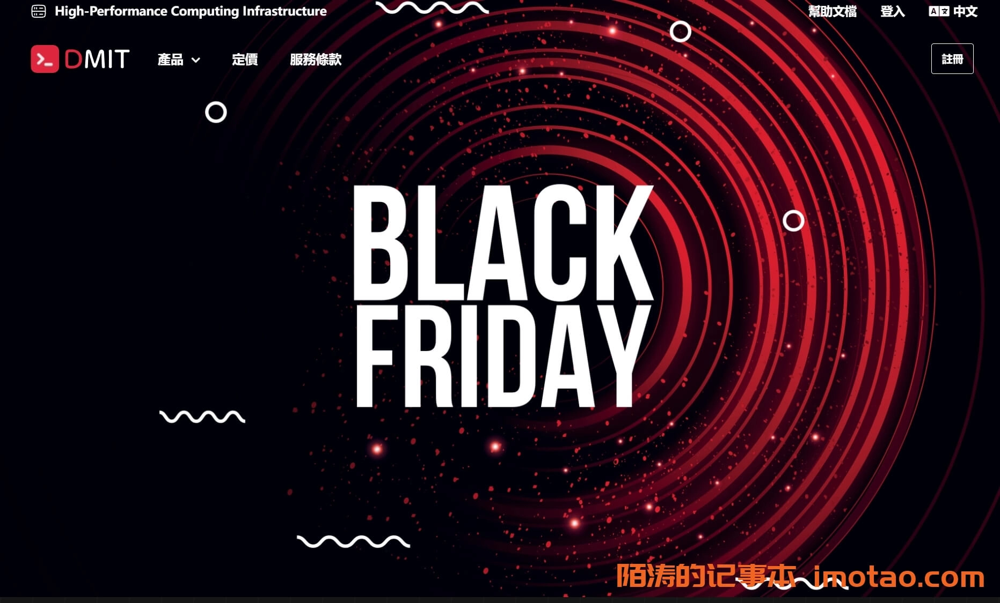

# DMIT黑五大促：Pro系列买二送一，这波薅羊毛指南来了

---

如果你正在找稳定的CN2 GIA线路VPS，又觉得平时价格有点肉疼，那这次DMIT的黑五活动可能值得关注。香港、洛杉矶、东京三地Pro系列买二送一，虽然赠送的只免首个账期，但对于想测试多地节点或短期项目来说，相当于打了个6.6折。另外EB和T1系列也有满额返现，适合预算充足、需要大带宽的场景。

---

## 活动时间别记错了

UTC时间2023年11月24日凌晨5点到29日凌晨5点，换算成北京时间就是24日下午1点到29日下午1点。闪购部分据说是24日美西时间0点开抢，也就是北京时间下午4点左右，具体以官网公告为准。

---

## Pro系列买二送一：适合薅羊毛的场景

这次活动覆盖洛杉矶、东京、香港三地的Pro系列。规则很直白：买两台送一台，如果两台配置不同，送的是便宜那台。**注意赠送的机器只免首个账期费用**，续费时还是要正常付钱的。

举个例子：如果你买两台洛杉矶Pro STARTER（月付29.9美元），就送一台同配置的机器，相当于三台机器总共59.8美元用一个月。对于需要临时搭建多节点测试环境、或者想对比不同地区延迟的用户来说，这个时间窗口够用了。

### 洛杉矶 Pro STARTER

- **CPU**：2核 AMD EPYC 7443P（主频2.85-4.0GHz）
- **内存**：2GB DDR4
- **硬盘**：40GB SSD RAID10
- **流量**：每月3TB，10Gbps端口，CN2 GIA双向计费，超出后限速不断网
- **IP**：1个IPv4 + 1个IPv6
- **价格**：29.9美元/月

适合建站或轻量应用，CN2 GIA回国线路在晚高峰表现稳定。如果你在考虑美西节点，👉 [可以看看DMIT的网络架构和实测数据](https://www.dmit.io/aff.php?aff=13832)，他们家自有AS906和AS54574，在洛杉矶有多个数据中心，线路冗余度比较高。

### 东京 Pro STARTER

- **CPU**：1核 AMD EPYC 7443P
- **内存**：1.5GB DDR4
- **硬盘**：20GB SSD RAID10
- **流量**：每月500GB，100Mbps端口，CN2 GIA双向计费
- **IP**：1个IPv4 + 1个IPv6
- **价格**：32.9美元/月

东京节点延迟低，适合对时延敏感的应用（比如游戏加速、实时通讯）。流量相对少一些，但100Mbps带宽跑满的话也够一般业务用。

### 香港 Pro STARTER

- **CPU**：1核 AMD EPYC 7443P
- **内存**：2GB DDR4
- **硬盘**：40GB SSD RAID10
- **流量**：每月800GB，100Mbps端口，CN2 GIA双向计费
- **IP**：1个IPv4 + 1个IPv6
- **价格**：79.9美元/月

香港价格明显高一截，但胜在物理距离近、延迟最低。如果预算允许，香港节点在华南地区的体验确实更好。

---

## EB和T1系列：满额返现，但没有国内优化

这两个系列走的是国际常规线路，没有CN2 GIA加持，回国速度和稳定性比不上Pro系列。活动力度是消费满100美元返10美元余额，满500返100，满1000返300。另外季付SJC.T1.STARTER及以上配置返50%，季付HKG.T1.STARTER及以上返70%。

**适用场景**：如果你的业务主要面向海外用户（比如外贸站、国际社交媒体运营），或者需要大带宽做数据传输，EB和T1系列性价比更高。但如果主要服务国内用户，还是建议选Pro系列。

需要注意的是，活动返还的余额不能提现，只能用于续费或购买其他服务。而且**所有活动产品不支持退款**，下单前最好明确自己的需求。

---

## 几个需要注意的点

1. **赠送产品的续费问题**：很多人容易忽略这点，送的那台机器只免首个账期。如果你打算长期用，续费时三台机器都要按正价收费，成本会上来。建议提前算好账，别被"买二送一"的字面意思误导。

2. **流量双向计费**：Pro系列的CN2 GIA流量是双向计算的，上传下载都算。如果你的业务有大量数据传输（比如备份、CDN源站），要留意流量消耗速度。

3. **超出流量后的限速策略**：DMIT不会直接停机，而是降速继续提供服务。这点对生产环境比较友好，至少不会突然断线导致业务中断。

4. **支付方式**：支持Paypal和支付宝，国内用户付款没什么障碍。客服也有中文支持，沟通起来方便。

---

## 这次活动适合谁

- **短期测试需求**：比如你在评估不同地区的VPS性能，买二送一正好可以同时对比三个节点，一个月时间足够跑完基准测试。
- **多项目并行**：手头有几个小项目需要分开部署，又不想在一台机器上混跑，三台独立环境刚好。
- **备用节点储备**：主力机器在用其他服务商，想找个备份方案，👉 [DMIT的Pro系列稳定性有口皆碑](https://www.dmit.io/aff.php?aff=13832)，作为容灾节点比较合适。

如果你是长期用户，更在意性价比而不是首月优惠，可能直接买年付套餐更划算。这次活动本质上是降低了短期使用成本，长期持有的话优势不明显。

---

## 总结

DMIT这次黑五活动的核心亮点在于Pro系列的买二送一，给了想测试多地节点的用户一个低成本窗口。香港、洛杉矶、东京三地都是CN2 GIA直连，网络质量有保障，硬件用的是AMD EPYC 7443P + DDR4 + SSD RAID10，配置不算寒酸。

不过要注意赠送机器只免首个账期，续费时还是正常收费。如果你就是想短期用，或者对比测试一下不同节点的表现，这波可以上。长期用户的话，建议算清楚总成本再决定。

最后提醒一句：活动产品不支持退款，下单前想清楚自己到底需要什么。👉 [更多关于DMIT网络架构和线路优化的信息可以看这里](https://www.dmit.io/aff.php?aff=13832)，他们家的AS自治域和多数据中心布局在业内算是比较扎实的。
